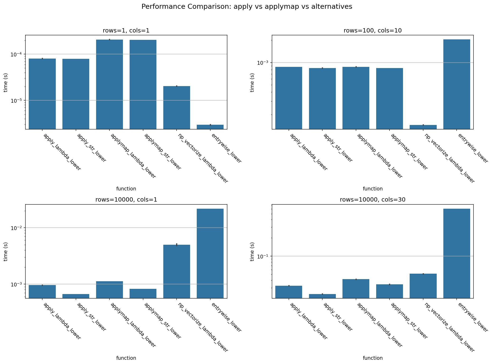

# Coding Projects

A collection of coding projects and experiments by [@k1monfared](https://github.com/k1monfared).

## Projects

| Project | Description | Language |
|---------|-------------|----------|
| [gpt-logged-chat](gpt-logged-chat/) | A terminal-based ChatGPT wrapper with conversation logging, built with LangChain and OpenAI's API | Python |
| [pandas-apply-vs-applymap](pandas-apply-vs-applymap/) | Performance benchmark comparing six methods for element-wise string operations in pandas DataFrames | Python (Jupyter) |

## Project Summaries

### GPT Logged Chat

A command-line interface for interacting with OpenAI's GPT models. Conversations are automatically timestamped and saved to log files for future reference. Uses LangChain as the interface layer.

- **Key file**: `logged_chat.py`
- **Requirements**: `langchain`, `openai`, an OpenAI API key

### Pandas: apply vs applymap

A systematic benchmark that compares `apply`, `applymap`, `np.vectorize`, and nested for loops for converting DataFrame string entries to lowercase. Tests across varying DataFrame sizes (rows, columns, string lengths) with 1,000 repetitions per configuration. The main finding is that `apply(str.lower)` with a column loop is the fastest method for realistic DataFrame sizes.

- **Key file**: `analysis.ipynb`
- **Data**: `times.csv`, `times_2.csv`
- **Output**: See the [images](pandas-apply-vs-applymap/images/) folder for generated plots

