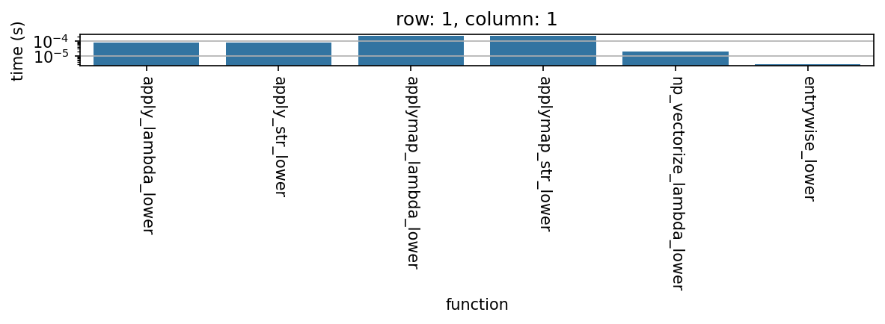
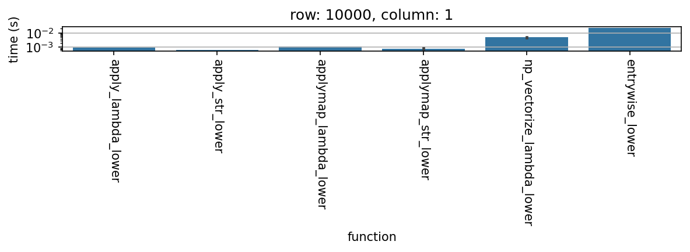
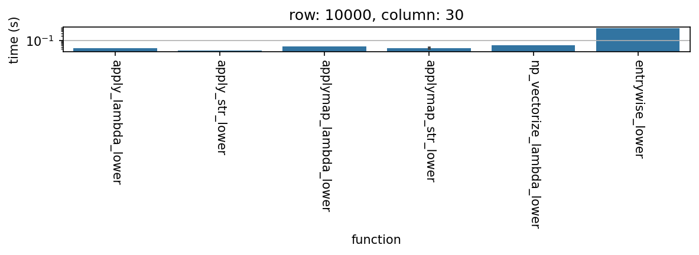
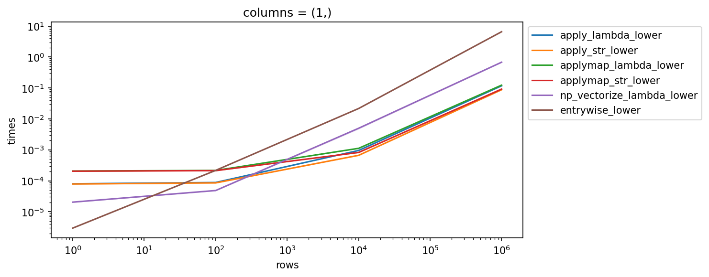
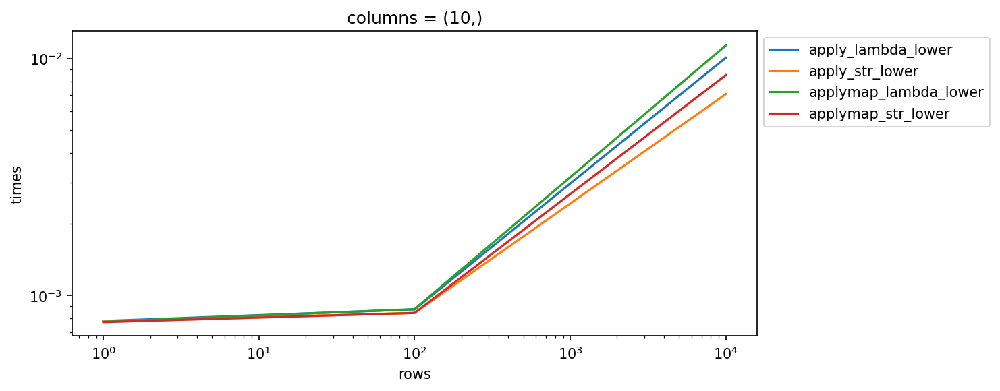
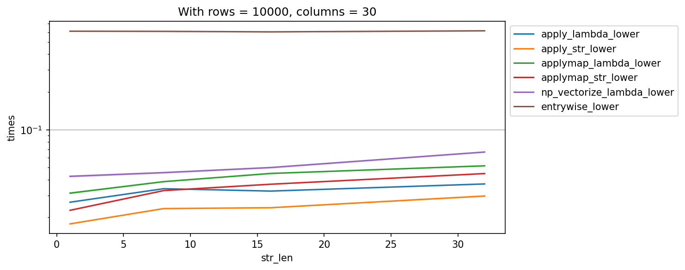

# Pandas: apply vs applymap -- Performance Benchmark

A systematic benchmark comparing different methods for applying element-wise string operations across a pandas DataFrame. The specific task is converting all string entries to lowercase, tested using six different approaches.

## Methods Compared

| Method | Description |
|--------|-------------|
| `apply_lambda_lower` | `df[col].apply(lambda x: x.lower())` looping over columns |
| `apply_str_lower` | `df[col].apply(str.lower)` looping over columns |
| `applymap_lambda_lower` | `df.applymap(lambda x: x.lower())` on the whole DataFrame |
| `applymap_str_lower` | `df.applymap(str.lower)` on the whole DataFrame |
| `np_vectorize_lambda_lower` | `np.vectorize(lambda x: x.lower())(df)` on the whole DataFrame |
| `entrywise_lower` | Nested `for` loop over all entries |

## Parameters

- **Rows**: 1, 100, 10,000, 1,000,000
- **Columns**: 1, 2, 3, 5, 10, 20, 30
- **String length**: 1, 8, 16, 32
- **Repeats**: 1,000 per configuration

## Key Findings

### Overhead (1 row, 1 column)
When the DataFrame is trivially small, method overhead dominates. The nested for loop has the lowest overhead, followed by `np.vectorize`, then `apply`, and finally `applymap`.

### Scaling with rows (10,000 rows)
As the number of rows increases, `apply(str.lower)` becomes the clear winner. The `str.lower` method reference is consistently faster than an equivalent `lambda`. The nested for loop and `np.vectorize` become increasingly worse.

### Scaling with columns (10,000 rows, 30 columns)
With many columns, `apply(str.lower)` remains best. `applymap` starts catching up to `apply` but never overtakes it within the tested range.

### Summary across scales

### Trends

Performance as a function of row count (log-log scale), showing all methods:

Zoomed in on just the `apply` and `applymap` variants:

Effect of string length (10,000 rows, 30 columns):

## Conclusions

1. **`apply(str.lower)` is the fastest** for realistic DataFrame sizes (100+ rows).
2. **Passing `str.lower` directly** is faster than wrapping it in a `lambda` -- this holds for both `apply` and `applymap`.
3. **`applymap` has higher overhead** than `apply` with a column loop, but the gap narrows with more columns.
4. **`np.vectorize` and nested for loops** should be avoided for DataFrames with many rows.
5. **String length** has minimal impact on the relative ordering of methods.

## Files

- `analysis.ipynb` -- Full Jupyter notebook with simulation code, plots, and discussion
- `times.csv` -- Raw timing data from the main simulation
- `times_2.csv` -- Raw timing data from the refined simulation
- `images/` -- Generated plots

## Requirements

- Python 3
- pandas
- numpy
- seaborn
- matplotlib
